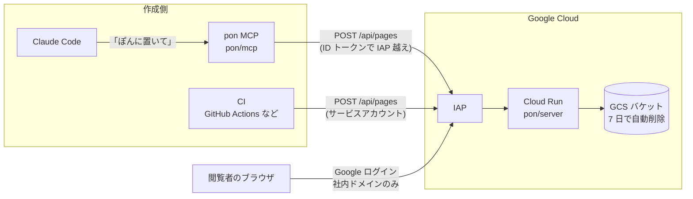

# ぽん 🫳 — 社内 HTML ホスティング環境

BASE 社のブログ記事
[「社内にHTMLをホストする環境を作ったら社内情報の流れが変わった」](https://devblog.thebase.in/entry/pon)
(2026-06-17、CTO 川口氏)で紹介された社内ツール「ぽん」のクローン実装です。

## これは何?

AI エージェント(Claude Code など)は調査レポートや設計メモといったドキュメントを
大量に生み出します。しかし Markdown ファイルのままでは「流通はするが読まれない」——
リポジトリの奥に置かれたレポートをわざわざ開く人はいません。

「ぽん」は、AI が生成した HTML を **1 枚のページとして社内にホストし、URL で渡す**
ための小さな基盤です。Claude Code に「ぽんに置いて」と言うだけで社内限定の URL が
発行され、Slack に貼れば誰でもワンクリックで読める。これだけで社内の情報の流れが
変わった、というのが元記事の趣旨です。

- **名前の由来**: 「ファイルをポンと置きたい」から「pon」。社内では
  「資料を pon しました」という動詞として使われるようになったそうです。
- **7 日で自動削除**: 置きっぱなしのドキュメントが肥大化しないよう、
  アップロードされたページはデフォルトで 7 日後に自動削除されます
  (フロー情報のための場であり、ストック情報は正規のドキュメント基盤へ)。
- **CI からも使える**: API を直接叩けるので、パフォーマンスレポートを CI から
  定期アップロードする、といった使い方もできます。

## アーキテクチャ

- **保存**: Google Cloud Storage(非公開バケット、7 日で自動削除)
- **配信**: Cloud Run(Node.js サーバー)
- **認証**: Identity-Aware Proxy(IAP)を Cloud Run に直接有効化し、
  Google Workspace の社内ドメインユーザーのみアクセス許可
  (以前は IAP にロードバランサが必要でしたが、今は Cloud Run に直接設定できるため低コスト)
- **アップロード**: Claude Code から MCP 経由。IAP はサービスアカウントの
  ID トークン(`PON_IAP_AUDIENCE`)で越える



## ディレクトリ構成

| ディレクトリ | 役割 |
|---|---|
| [`server/`](./server/) | 配信・アップロード API(Node.js)。GCS(またはローカルディレクトリ)に保存した HTML を配信し、一覧 UI を提供 |
| [`mcp/`](./mcp/) | Claude Code 用 MCP サーバー。「ぽんに置いて」で `POST /api/pages` を呼び、発行された URL を返す |
| [`infra/`](./infra/) | Terraform 一式(GCS・Cloud Run・IAP)とデプロイ手順 |

## クイックスタート

### ローカルで試す

GCP なしで動かせます。

1. サーバーをローカルディレクトリ保存モードで起動

   ```bash
   cd server
   npm install
   PON_LOCAL_DIR=/tmp/pon-pages PORT=8080 npm start
   ```

2. MCP をローカルサーバー向きで Claude Code に登録

   ```bash
   cd mcp
   npm install
   claude mcp add pon -e PON_BASE_URL=http://localhost:8080 -- node /path/to/pon/mcp/dist/index.js
   ```

   (正確なコマンド・ビルド手順は `mcp/` の README を参照)

3. Claude Code に依頼

   > この調査結果を HTML にまとめて、ぽんに置いて

   返ってきた `http://localhost:8080/p/<slug>/` を開けば完成です。
   `http://localhost:8080/` で一覧 UI も見られます。

### 本番デプロイ(GCP)

[`infra/README.md`](./infra/README.md) の手順に従ってください。概要は:

1. `gcloud builds submit` で `server/` のイメージを Artifact Registry に push
2. `terraform apply`(`project_id` / `allowed_domain` / `image` などを指定)
3. 出力された `service_url` をブラウザで開き、社内 Google アカウントでログイン
4. MCP に `PON_BASE_URL=<service_url>` と `PON_IAP_AUDIENCE` を設定して登録

## API 契約(server)

IAP の背後で提供される API です。CI から直接叩くこともできます。

| エンドポイント | 内容 |
|---|---|
| `POST /api/pages` | ページ作成。ボディ `{title, html, slug?}` → レスポンス `{slug, url, title}` |
| `GET /api/pages` | ページ一覧(JSON) |
| `GET /p/:slug/` | ページ配信(HTML) |
| `GET /` | 一覧 UI(ブラウザ向け) |

例(IAP 越しに CI からアップロード):

```bash
TOKEN=$(gcloud auth print-identity-token --audiences="$PON_IAP_AUDIENCE" \
  --impersonate-service-account="$UPLOADER_SA")
curl -sS -X POST "$PON_BASE_URL/api/pages" \
  -H "Authorization: Bearer $TOKEN" \
  -H "Content-Type: application/json" \
  -d '{"title": "週次パフォーマンスレポート", "html": "<!doctype html>..."}'
```

## 注意

- ページは**デフォルト 7 日で自動削除**されます(`infra` の `retention_days` で変更可)。
- 社内ドメイン(`allowed_domain`)の Google アカウント以外からはアクセスできません。
- 機密度の高い情報を扱う場合は、組織のポリシーに従って運用してください。

## 参考

- 元記事: [社内にHTMLをホストする環境を作ったら社内情報の流れが変わった — BASE Product Team Blog](https://devblog.thebase.in/entry/pon)(2026-06-17、CTO 川口氏)
